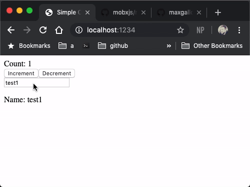

# Simple Observable Example

A simple observable implementation that's similar to [mobx]([github.com/](https://github.com/mobxjs/mobx)) with Proxy api. Inspired by [Reinventing MobX Talk](https://github.com/maxgallo/talk-reinventing-mobx).



Running

```sh
yarn install
yarn dev
```
